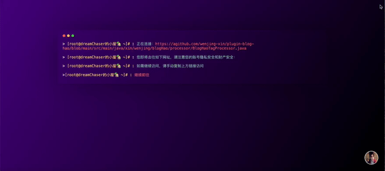
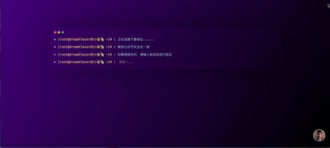
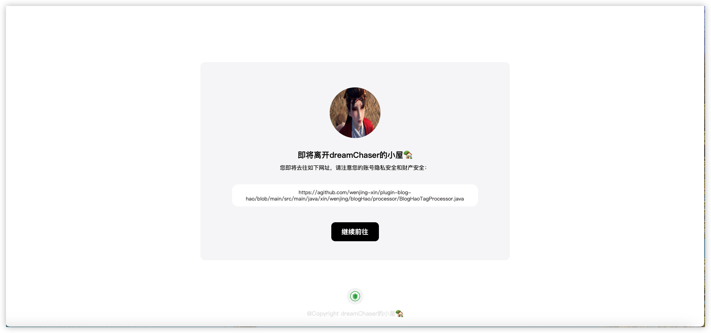
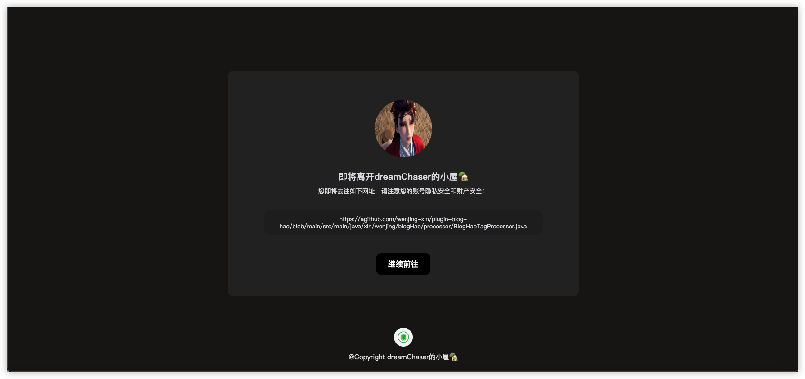

# link-security-detect

>**链接安全跳转中台，为你的halo博客站点添加一个安全跳转中台！**

[详细文档](https://blog.wenjing.xin/docs/halo-plugins/lsd-plugin/introduce)

## 一、效果预览
### 1、默认风格的中台模版

可自定义背景

### 2、极客风格的跳转中台
普通链接 

下载链接 

### 3、简约风格的跳转中台

系统亮色模式下 

系统暗色模式下 

## 二、声明
> 此插件为闭源项目，代码会经过官方审查，请放心使用！请勿用于其他非法用途，否则后果自负！

## 三、插件主要功能：
* 文章页面和自定义单页面链接加入安全跳转中台
* 主题提供的模版页面链接可支持安全跳转中台跳转（需要自行开启）
* 自定义白名单，支持泛域名（V1.5.0版本之后）
* 兼容链接管理插件的链接数据，可以排除不需要加入的组别
* 自定义安全中台页面内容，多种模版可供选择
* 兼容编辑器超链接卡片插件的链接
* 支持白名单链接缓存刷新
* 自定义链接跳转提示信息
* 下载链接跳转时支持验证功能

## 四、使用方式
1. 下载插件:GitHub下载Jar文件上传或去官方应用市场下载（暂时等待通知上架！）
2. 配置插件信息，具体使用文档请[点击此处查看](https://www.wenjing.xin/archives/407506e2-ce19-43bb-a7ee-4e92e054a91e)
3. 网盘下载：[链接在这儿](https://pan.baidu.com/s/1MH3-BuwdPQNrfFaS0JBb2w?pwd=njka)

## 五、TODO
- [x] 增加链接管理插件数据是否兼容的自定义配置
- [x] 增加随机背景图
- [x] 增加自定义页面添加链接安全跳转中台
- [x] 增加文章页面下载验证码功能
- [X] 优化不同编辑器文章内容的链接识别功能
- [ ] 优化网站的安全检测功能
- [ ] 增加常见评论区链接跳转中台
- [ ] 增加主题内置页面的链接安全跳转中台
- 
## 赞助我
如果你感觉这个插件还不错，请我喝杯咖啡☕️☕️☕️

[爱发电⚡️](https://afdian.net/a/wb258123)

## 插件交流群
QQ群，加群后管理员自动审核

&emsp;&emsp;

> 本项目使用 JetBrains IDEA 进行开发
> 
> 

